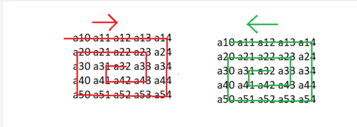

_## Отчет по лабораторной работе № 2

#### № группы: `ПМ-2402`

#### Выполнил: `Коротеева Юлия Андреевна`

#### Вариант: `14`

### Cодержание:

- [Постановка задачи](#1-постановка-задачи)
- [Входные и выходные данные](#2-входные-и-выходные-данные)
- [Выбор структуры данных](#3-выбор-структуры-данных)
- [Алгоритм](#4-алгоритм)
- [Программа](#5-программа)
- [Анализ правильности решения](#6-анализ-правильности-решения)

### 1. Постановка задачи

> Программа получает на вход целое число N - количество строк и M - количество столбов. Кроме того, вводится целое число T.
> Программа выполняет следующие действия: сортирует столбцы по возрастанию количества точек со значениями, меньшими заданного
> значения T в каждом столбце. Если же количества равны, то программа сортирует по количеству точек со значениями, большими T.
> Затем в отсортированном массиве находим наименьшее, часто встречающееся значение и выводим это число на экран. Все элементы
> отсортированного массива выводим в виде спирали, начиная с центрального элемента и двигаясь против часовой стрелки. В конце
> в отсортированном массиве находим элементы, значения которых меньше значения T, и заменяем их значением T.

Данную задачу можно разбить на несколько подзадач:
1. Считывание размера матрицы, количества элементов и самих элементов!!!!
2. Сортировка методам пузырька по нужным нам условиям.
3. Нахождения наименьшего, часто встречающегося элемента.
4. Вывод массива в виде спирали.
5. Замена элементов, меньших значения T на само T.


### 2. Входные и выходные данные

#### Данные на вход

На вход программа должна получать натуральные числа N и M. Числа натуральные, так как они
задают количество строк и столбцов в двумерном массиве. Минимальное значение N и M будет 1,
так как в массиве должна содержаться хотя бы одна строка, и она не должна быть пустая.
Максимальное значение - 2<sup>31</sup>-1. Значения элементов массива также целые числа.
Для дальнейшего решения введем целое число T.

|               | Тип         | min значение    | max значение     |
|---------------|-------------|-----------------|------------------|
| N             | Целое число | 1               | 2<sup>31</sup>-1 |
| M             | Целое число | 1               | 2<sup>31</sup>-1 |
| matrix [i][j] | Целое число | -2<sup>31</sup> | 2<sup>31</sup>-1 |
| T             | Целое число | -2<sup>31</sup> | 2<sup>31</sup>-1 |


#### Данные на выход

Программа делает 3 вывода:
1) в отсортированном по нужным нам условиям массиве находим и выводим наименьшую часто встречающуюся температуру;
2) элементы массива в виде спирали, начиная от центра и двигаясь против часовой стрелки;
3) целочисленный массив, в котором всем элементы ниже заданного значения T заменены на T;

Для целочисленного массива новых элементов обозначим диапазон значений самостоятельно.
Минимальный элемент в основном массиве -2<sup>31</sup>.
Максимальный элемент основного массива равен 2<sup>31</sup>-1.


|              | Тип            | min значение    | max значение           |
|--------------|----------------|-----------------|------------------------|
| mostFrequent | Целое число    | -2<sup>31</sup> | 2<sup>31</sup>-1       |
| matrix[i][j] | Целое число    | -2<sup>31</sup> | 2<sup>31</sup>-1       |

### 3. Выбор структуры данных

Программа получает целые числа N, M и T. Для их хранения будем использовать переменные (N, M, T)
типа int.

|    | название переменной | Тип (в Java) |
|----|---------------------|--------------|
| N  | `N`                 | `int`        |
| M  | `M`                 | `int`        |
| T  | `T`                 | `int`        |

### 4. Алгоритм

#### Математическая модель:

Рассмотрим, как реализуется вывод элементов двумерного массива в виде спирали, начиная с центрального элемента.



#### Алгоритм выполнения программы:

1. **Ввод данных:**
   На вход программа должна получать натурально число N и M. Для этого используется метод nextInt().

2. **Создание и заполнение матрицы:**

   Программа создает двумерный массив a размером N строк одинаковой длины, используя вложенные циклы
   для заполнения матрицы: внешний проходит по строкам (от 0 до N), в нем считывает размер каждой строки,
   внутренний - по столбцам (от 0 до M). А для каждого элемента запрашивает у тестировщика число, сохраняя его в ячейку matrix[i][j].

3. **Сортировка методам пузырька по нужным нам условиям:**
   Вводится число T для обозначения константы, с которой будет сравнивать элементы массива.
   Для этого используется метод nextInt(). Затем создаем два массива lowerCount и higherCount, в которых будет сохранять количество точек меньших
   или больших значения T. C помощью массива matrix посчитаем эти точки. Теперь обратимся к пузырьковой сортировке и сравним соседние элементы массива.
   Каждый проход сравнивает соседние элементы и меняет их местами в сторону возрастания, если они находятся в неправильном порядке. Во время
   сортировки основного массива не только соответствующие столбцы массива меняются местами, но и элементы lowerCount и higherCount также меняются местами.
   После этого выводится отсортированный массив.

4. **Нахождение наименьшего часто встречающегося элемента:**
   В предыдущем пункте мы отсортировали элементы массива по возрастанию. Теперь создаем массив frequency для хранения частоты
   каждой температуры. Вложенные циклы for перебирают каждый элемент matrix[i][j] двумерного массива matrix. Поскольку индексы
   массива должны быть неотрицательными, а температуры могут быть отрицательными, то необходимо указать смещение на 100. Затем
   вводим переменные для нахождения наименьшего часто встречающегося элемента. Перебираем элементы массива согласно условию. Если
   текущая частота равна максимальной, а температура меньше, чем текущая наиболее частая температура, то выбираем температуру
   с наименьшим индексом.

5. **Вывод массива в виде спирали:**
   Сначала вводим четыре переменных, которые будут хранить в себе значения начальных точек тех или иных строк и столбцов.
   Затем будем перебирать элементы строки до тех пор, пока не дойдем до последнего элемента в этой строке. Совершим поворот
   на 90 градусов по часовой стрелке и перейдем от строки к столбцу. Будем использовать этот алгоритм до тех пор, пока не
   пройдем все элементы массива, в конечном счете оказавшись в центральной точке массива. Сохраняем все элемент двумерного массива
   в одномерном массиве arr[i][j]. Чтобы вывести на экран массив в виде спирали, начиная от центра и двигаясь против часовой
   стрелки, нужно развернуть получившийся одномерный arr[i][j].
   Однако не стоит забывать, что не все массивы можно вывести в виде спирали, поэтому накладываем ограничения: количество
   строк должно совпадать с количеством столбцов и количество столбцов и строк должно превышать 2.

6. **Замена всех элементов меньших T на T:**
   В отсортированном массиве matrix[i][j] используются два вложенных цикла: внешний цикл (for (int i = 0; i < N; i++))
   проходит по каждой строке двумерного массива matrix, внутренний цикл (for (int j = 0; j < M; j++))
   проходит по каждому элементу текущего столбца. Далее находим элементы, значения которых меньше T и заменяем их на само
   значение T. Затем выводим новый массив matrix[i][j]. После завершения внутреннего цикла вызывается out.println();,
   чтобы перейти на новую строку для вывода следующей строки массива.

### 5. Программа

```java
import java.io.PrintStream;
import java.util.Scanner;

public class Main {
   public static Scanner scanner = new Scanner(System.in);
   public static PrintStream out = System.out;
   public static void main(String[] args) {
      // 1. Считываем размеры массива N и M и его элементы
      System.out.println("Введите размеры массива N и M:");
      int N = scanner.nextInt();// количество строк
      int M = scanner.nextInt();//количество столбцов

      int[][] matrix = new int[N][M];//вводим двумерный массив
      System.out.println("Введите элементы массива:");
      for (int i = 0; i < N; i++) {
         for (int j = 0; j < M; j++) {
            matrix[i][j] = scanner.nextInt();//выводим произвольный массив с клавиатуры
         }
      }

      System.out.println("Введите значение T:");
      int T = scanner.nextInt(); // произвольное значение температуры

      // 2. Сортируем столбцы массива
      int[] lowerCount = new int[M]; // меньше T
      int[] higherCount = new int[M]; //больше T

// Подсчёт точек ниже и выше T для каждого столбца
      for (int j = 0; j < M; j++) {
         for (int i = 0; i < N; i++) {
            if (matrix[i][j] < T) {
               lowerCount[j]++;//  считаем количество точек в каждом столбце, значения которых меньше T
            } else if (matrix[i][j] > T) {
               higherCount[j]++;// считаем количество точек в каждом столбце, значения которых больше T
            }
         }
      }

      // Сортируем столбцы пузырьковой сортировкой
      for (int j = 0; j < M - 1; j++) { //каждый проход сравнивает соседние элементы и меняет их местами, если они находятся в неправильном порядке
         for (int k = 0; k < M - j - 1; k++) { //каждый проход сравнивает уже отсортированные элементы с индексами
            if (lowerCount[k] > lowerCount[k + 1] ||
                    (lowerCount[k] == lowerCount[k + 1] && higherCount[k] > higherCount[k + 1])) { // сравниваем значения точек относительно T с соседним столбцом
//Меняем столбцы местами, так как нужно расставить их по возрастанию
               for (int i = 0; i < matrix.length; i++) { //
                  int temp = matrix[i][k];
                  matrix[i][k] = matrix[i][k+1];
                  matrix[i][k+1] = temp;
               }
// Меняем данные в массиве подсчёта, так как изменили порядок столбцов
               int temp = lowerCount[k];
               lowerCount[k] = lowerCount[k + 1];
               lowerCount[k + 1] = temp;

               temp = higherCount[k];
               higherCount[k] = higherCount[k + 1];
               higherCount[k + 1] = temp;
            }
         }
      }

      // 3. Находим самую часто встречающуюся температуру
      int[] frequency = new int[201]; // Диапазон температур от -100 до 100

      for (int i = 0; i < matrix.length; i++) { // Проходим по строкам массива
         for (int j = 0; j < matrix[i].length; j++) { // Проходим по элементам в каждой строке
            frequency[matrix[i][j] + 100]++; // Смещение для работы с отрицательными значениями
         }
      }

      int maxFrequency = 0; // хранит максимальные частоты
      int mostFrequent = -100; // хранит индекс элемента
      for (int i = 0; i < frequency.length; i++) {
         if (frequency[i] > maxFrequency || (frequency[i] == maxFrequency && i - 100 < mostFrequent)) {
            maxFrequency = frequency[i]; // обновляет новую максимальную частоту
            mostFrequent = i - 100;// обновляет индекс с наибольшей частотой(или наименьшим индексом)
         }
      }
      System.out.println("Самая часто встречающаяся температура: " + mostFrequent);

      for (int i = 0; i < matrix.length; i++) {
         for (int j = 0; j < matrix[i].length; j++) {
            System.out.print(matrix[i][j] + " ");
         }
         System.out.println();
      }

      // Подзадача 4
      System.out.println("Элементы массива выполнены в виде спирали:");

      int top = 0;// индекс первого элемента столбца
      int bottom = N - 1;// индекс последнего элемента столбца
      int left = 0; // индекс первого элемента строки
      int right = M - 1; // индекс последнего элемента строки

      // рассматриваем случаи существования спирали
      if (N==M && M > 2) { // в других случаях в массиве отсутствует центр, а значит спирали, начинающейся в центре, не существует
         int[] arr = new int[N * M];
         int count = 0;
         while (top <= bottom && left <= right) { // рассматривает случаи до границ массива (снизу, сверху, слева, справа)
            for (int i = left; i <= right; i++) { // начинаем с первого левого элемента строки и движемся до тех пор, пока справа элементы строки не закончатся
               arr[count] = matrix[top][i]; // строка копирует элементы из двумерного массива в одномерный
               count++; // счетчик увеличивается, показывая существование свободной позиции в массиве
            }
            top++; // поворачиваемся на 90 градусов по часовой стрелке, переходя от строки к столбцу
            for (int i = top; i <= bottom; i++) { // // начинаем с первого верхнего элемента столбца и движемся до тех пор, пока снизу элементы столбца не закончатся
               arr[count] = matrix[i][right];// строка копирует элементы из двумерного массива в одномерный
               count++;// счетчик увеличивается, показывая существование свободной позиции в массиве
            }
            right--; // поворачиваемся на 90 градусов по часовой стрелке, переходя от столбца к строке
            if (top <= bottom) { // если еще остались элементы, то рассматриваем те же случаи, поменяв местами начало и конец
               for (int i = right; i >= left; i--) {
                  arr[count] = matrix[bottom][i];
                  count++;
               }
               bottom--;// поворачиваемся на 90 градусов по часовой стрелке, переходя от строки к столбцу
            }
            if (left <= right) {// если еще остались элементы, то рассматриваем те же случаи, поменяв местами начало и конец
               for (int i = bottom; i >= top; i--) {
                  arr[count] = matrix[i][left];
                  count++;
               }
               left++;// поворачиваемся на 90 градусов по часовой стрелке, переходя от столбца к строке
            }
         }
         for (int i = arr.length - 1; i >= 0; i--) { // развернем получившийся одномерный массив
            System.out.print(arr[i] + " "); // получим массив в виде спирали, начиная от центра и двигаясь против часовой стрелки
         }
      }
      else { // не забываем про условия, при которых необходимой спирали не существует
         System.out.print("Невозможно вывести массив в виде спирали, так как нет центрального элемента ");
      }
      System.out.println();

      // Подзадача 5
      System.out.println("Обновленный массив:");
      //выводим отсортированный массив
      for (int i = 0; i < N; i++) {
         for (int j = 0; j < M; j++) {
            if (matrix[i][j] < T) { // находим элементы, значения которых меньше T
               matrix[i][j] = T; // заменяем эти элементы T
            }
            System.out.print(matrix[i][j] + " "); // выводим получившийся массив
         }
         System.out.println();
      }
   }
}


```

### 6. Анализ правильности решения

Программа работает корректно на всем множестве решений с учетом ограничений.

1. Тест на ограничение: M = 0:

    - **Input**:
        ```
        2
        0
        ```

    - **Output**:
        ```

        ```

2. Тест на ограничение: M = -7:

    - **Input**:
        ```
        4
        -7
        ```

    - **Output**:
        ```
        Exception in thread "main" java.lang.NegativeArraySizeException: -7
        ```
3. Тест на ограничение: N = -8:

    - **Input**:
      ```
      -8
      2
      ```

    - **Output**:
      ```
      Exception in thread "main" java.lang.NegativeArraySizeException: -8
      ```

4. Тест на проверку подзадачи 2:

   - **Input**:
       ```
       4
       4
       7 3 1 5
       8 1 4 7
       3 9 7 1
       2 5 8 3
       4
       ```

   - **Output**:
       ```
       2.Отсортированный массив:
       1 3 5 7
       4 1 7 0
       7 9 1 3
       8 5 3 2
       ```

5. Тест на проверку подзадачи 2:

    - **Input**:
        ```
        2
        2
        1 2
        3 4
        2
        ```

    - **Output**:
        ```
        2.Отсортированный массив:
        Невозможно вывести массив в виде спирали, так как нет центрального элемента
        ```

6. Тест на проверку подзадачи 3 (часто встречающаяся цифра):

   - **Input**:
       ```
       3
       3
       -3 2 8
       0 1 2
       3 3 7
       4

       ```

   - **Output**:
       ```
       2.Отсортированный массив:
       8 -3 2
       2 0 1
       7 3 3

       3.Самая часто встречающаяся температура: 2

       ```
7. Тест на проверку подзадачи 4:

   - **Input**:
       ```
       3
       3
       3 5 7
       0 9 5
       5 6 7
       4

       ```

   - **Output**:
       ```
       2.Отсортированный массив:
       5 7 3
       9 5 0
       6 7 5

       4. Вывод массива в виде спирали:
       5 9 6 7 5 0 3 7 5

       ```

8. Тест на проверку подзадачи 5 (все температуры ниже заданного значения T заменены на T):

    - **Input**:
        ```
        3
        3
        5 3 7
        1 2 3
        0 9 7
        4

        ```

    - **Output**:
        ```
        2.Отсортированный массив:
        7 5 3
        3 1 2
        7 0 9

        5.Обновленный массив:
        7 5 4
        4 4 4
        7 4 9

        ```

